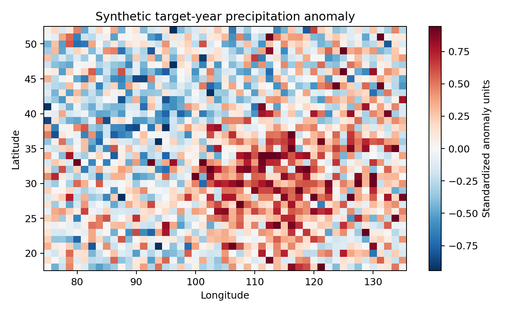
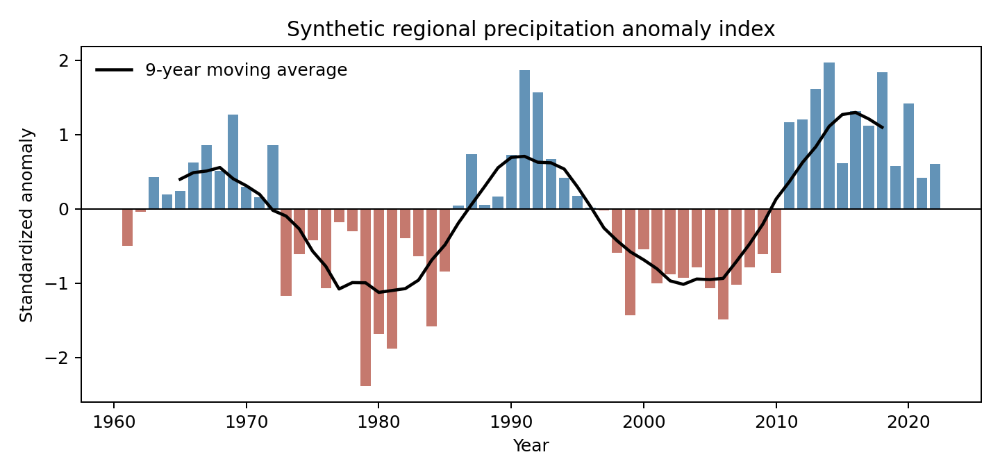
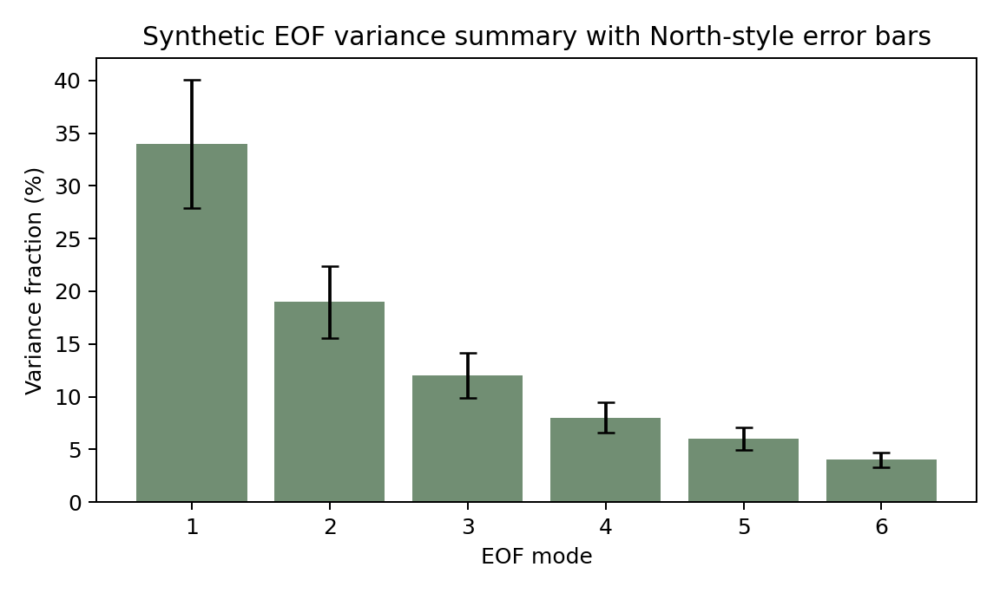
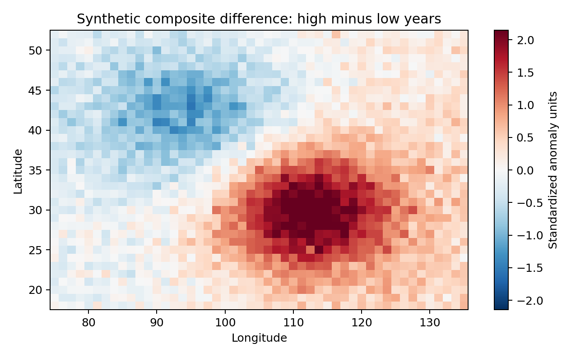
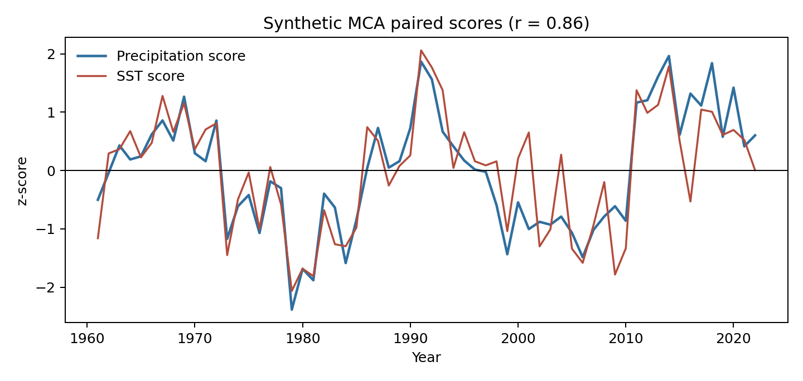

# Synthetic Inference Report

This report demonstrates how to turn the mini-lab outputs into a cautious public-facing interpretation. The figures and summary table are synthetic demonstration artifacts generated by `examples/generate_synthetic_demo_assets.py`; they are not real climate results.

## Demonstration Figures











## Example Interpretation

The synthetic target-year anomaly map shows a coherent positive anomaly over the central-eastern domain and weaker negative anomalies toward the northwest. In a real analysis, this would motivate checking whether the spatial anomaly aligns with a dominant EOF loading pattern and whether the regional anomaly index also identifies the target year as unusual.

The synthetic regional anomaly series shows multi-year fluctuations around zero with a positive target-year standardized anomaly. The moving average suggests low-frequency variability, but this alone should not be interpreted as a forced trend. A trend map and formal slope diagnostic would be needed before making a background-change statement.

The synthetic EOF variance chart indicates that the first two modes dominate the demonstration variance, with the first mode contributing the largest share. In a real report, this would support using EOF1 and EOF2 as diagnostic coordinates, but it would not prove that the modes are physically independent. North-style error bars should be checked before assigning separate interpretations to adjacent modes.

The synthetic composite-difference map is spatially similar to the target-year anomaly. That agreement would strengthen a diagnostic story: selected high-anomaly years share a recurring spatial pattern. However, the composite is still conditional on the selected years and should be reported with group sizes and p-value limitations.

The synthetic MCA score plot shows positively related paired precipitation and SST scores. In real data, a strong paired score correlation would justify inspecting heterogeneous correlation maps and known climate-index context. It would not by itself establish that SST forcing caused the precipitation anomaly.

## Evidence-to-Claim Mapping

| Evidence | Conservative claim | Claim to avoid |
| --- | --- | --- |
| Coherent anomaly map | The target period departs from the configured baseline in a spatially organized way. | The anomaly has a known cause. |
| Regional standardized anomaly | The target period is unusual relative to this regional series. | The event is unprecedented. |
| EOF variance concentration | A small number of statistical modes summarize much of the variance. | EOF modes are physical mechanisms. |
| Composite similarity | Selected high and low groups show contrasting spatial structures. | Composite differences prove causality. |
| MCA paired scores | The two fields share a covariance pattern in the synthetic example. | One field drives the other. |

## Recommended Report Language

Use cautious phrasing:

```text
The configured target period shows a coherent precipitation anomaly relative
to the selected baseline. The regional standardized series places the target
period on the positive side of the distribution. EOF and composite diagnostics
suggest that the target pattern resembles a recurring mode in this configured
domain. Coupled-field MCA provides an additional association screen, but the
workflow does not establish causal attribution or operational predictability.
```

## Remaining Checks for Real Data

- Confirm dataset units, calendars, and aggregation period.
- Report the exact climatology baseline and target period.
- Inspect missing-data masks before interpreting maps.
- Document representative-year group sizes.
- Treat p-values as pointwise unless field-significance testing is added.
- Compare composite patterns across multiple variables before discussing circulation mechanisms.
